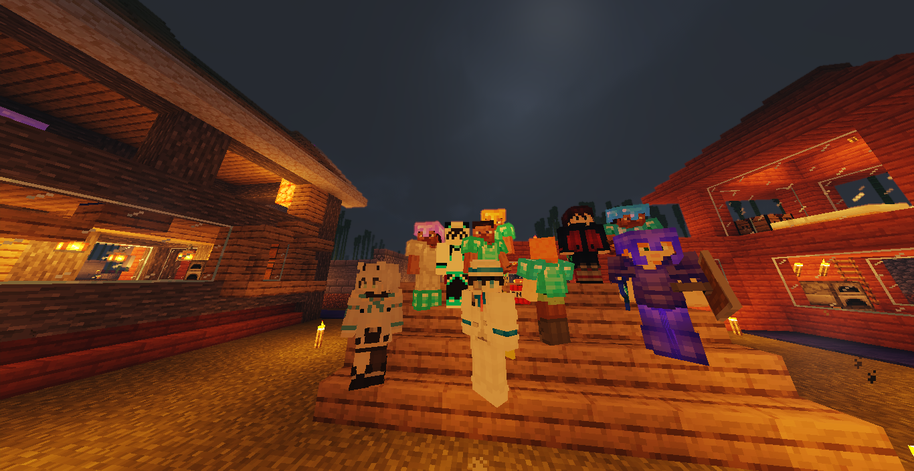

# 夜阑星空群服务器

QQ群：[992198378](https://jq.qq.com/?_wv=1027&k=yZWgY5Ku)

-----

## 开服日期

本服务器在2020年8月6日下午开服！

与2020年10月份升级为群组服务器

-----

## 简介

一切都是

闲的没事干

导致的

Emmmmmmmmmmm

MC百科地址：<a href="https://play.mcmod.cn/sv20184789.html" target="_blank">https://play.mcmod.cn/sv20184789.html</a>

-----

## 子服务器信息

| 夜阑星空群服务器列表 | 传送指令：/server 服务器id |            |                  |               |
| -------------------- | -------------------------- | ---------- | ---------------- | ------------- |
| 服务器名称           | 服务器id                   | 服务端核心 | 支持的客户端版本 | 开放时间      |
| 主城                 | lobby                      | 1.12.2     | 1.8.9-1.16.5     | 永远          |
| 生存主服（白名单）   | sc                         | 1.16.5     | 1.16.5           | 永远          |
| 生存二服             | sc2                        | 1.16.5     | 1.16.5           | 永远          |
| 猛男生存             | scmn                       | 1.16.5     | 1.16.5           | 永远          |
| 无规则服务器         | nogov                      | 1.12.2     | 1.8.9-1.16.5     | 永远          |
| 起床战争             | bedwars                    | 1.8.8      | 1.8.8-1.16.5     | 人多/有需要时 |
| 起床战争经验版       | bedwarsxp                  | 1.8.8      | 1.8.8-1.16.5     | 人多/有需要时 |
| 空岛战争             | ispvp                      | 1.8.8      | 1.8.8-1.16.5     | 人多/有需要时 |
| 活动服务器           | act                        | 1.16.5     | 1.16.5           | 搞活动时      |

-----

## 文档信息

本文档为群服务器的帮助文档

在这里你可以看到什么？见左边大纲√

本文档使用Github托管并开源

地址：https://github.com/luluxiaoyu/ylxkserver-help

如果对本文档不满意 你可以自己去GitHub下载并修改 

然后发给群主，，，

或者从GitHub fork后提交

-----