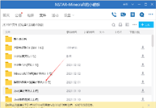

# 下载客户端

### 1.首先你需要注册一个账号（上一步）

### 2.然后在群文件下载服务器专用客户端

### 3.下载完成后，运行服务器安装程序

（一直下一步就ok，建议创建快捷方式）

 

### 4.安装完成后，运行客户端，并点击更新

 

下载完成后，客户端会自动解压

### 5.等待解压完成

解压完成会弹出提示框，如果长时间没有成功，建议看看解压日志，或者更换下载源，重新更新

 

客户端安装到此结束！