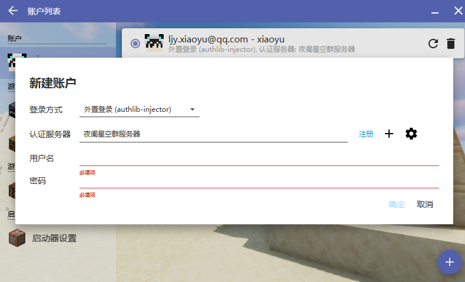
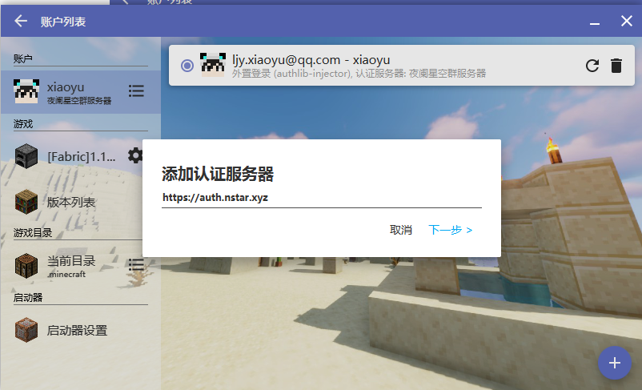
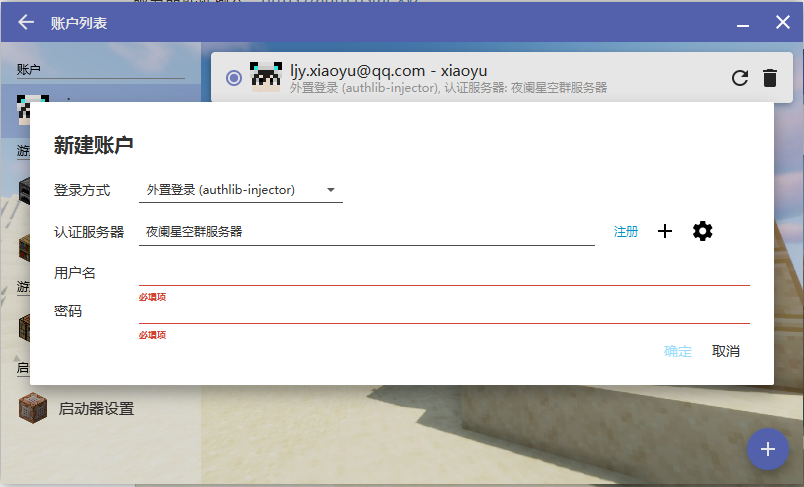

# 使用自己的客户端进入

在完成1.2.1-在登录系统注册后  

可以使用自己的客户端进入游戏  

## 具体方法

1.打开你的客户端（这里以HMCL为例子）

找到账户页面，添加账户

![image-20210208135225331]./6.assets/image-20210208135225331.png)

选择外置登录，并点击+

服务器地址输入：https://auth.nstar.xyz

然后，登录你注册的账户即可

然后开始游戏吧！

服务器地址：mc.nstar.xyz