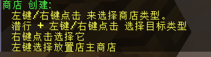
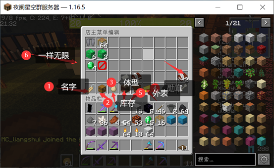

# 自己开商店

## 创建商店

1. 首先你需要到服务器商店购买一个村民（见上一章节）

2. 接下来需要准备一个箱子

3. 把箱子放下来

   并用手拿着村民蛋

   这时候，聊天栏会有提示

   

   首先，拿着村民蛋，对着天上按左键，选择到“交易商店”

   （出售商店也行。不过不建议，因为交易商店包含出售商店的功能）

   

   然后，再对着天上按住：shift+左键 选择你喜欢的商店生物

   （建议villager或者牌子）

   

   然后，对着箱子，拿着村民蛋，右键（绑定箱子）

   

   然后在地上右键放出村民即可（生成商店）

## 商店管理

下面就是教程

1.交换商店

先把你的东西放进去箱子里面

 对着你的商店，潜行+右键，进入管理页面

1可以修改商店名字（目前支持中文）

2是你所出售物品的库存数量

3是告示牌颜色

4为你要出售的商品（从你背包放进去）（左键增加数量，右键减少数量）

5为购买你的物品所需要的物品（在你背包放一个进去，但不会消耗你的背包物品）     （左键增加数量，右键减少数量） 

6为翻页

他人购买你的物品你就会获得你所需要的物品（放在商店箱子）

但同时你库存也会消耗

其次卖出的商品数量是不限  你也可以一直添加库存

接下里就可以经营你的小商店啦

2.交易商店

也是像上面一样. 但是放出来会为村民

Shift右键点开菜单编辑

1 2 6 7跟上面一样

3为体型.可以更改小村民与大村民

4是勋章（指村民胸前的等级）

8为村民职业

5为外表

他人购买你的物品你就会获得你所需要的物品

但同时你库存也会消耗

但是不同是你交易的物品需要放到旁边箱子里

其次在菜单编辑设定交易额（你要悄悄涨价.hhhh.）

物品随时可购买

最后大概就是这样了

 

初稿pooo，二次修改xiaoyu