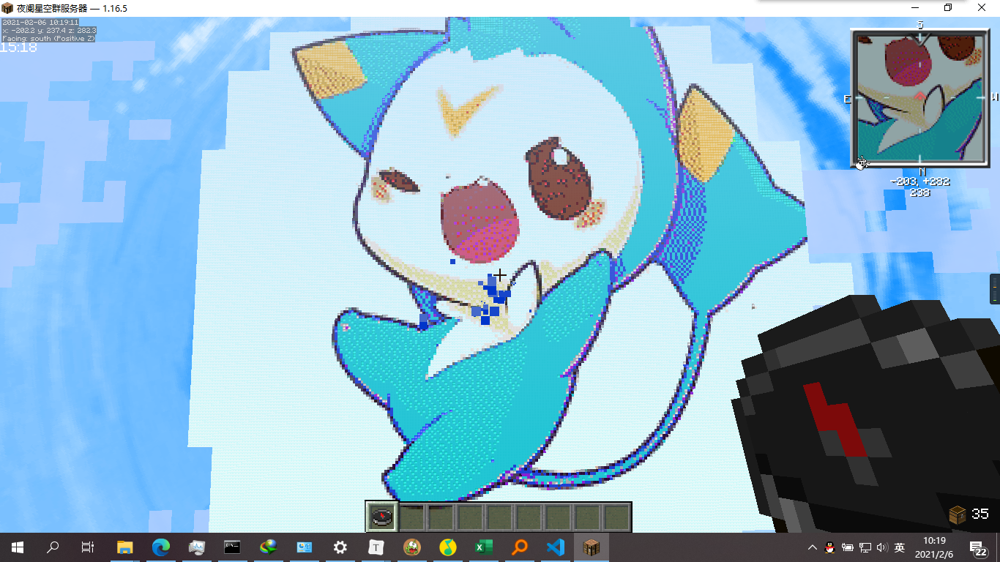
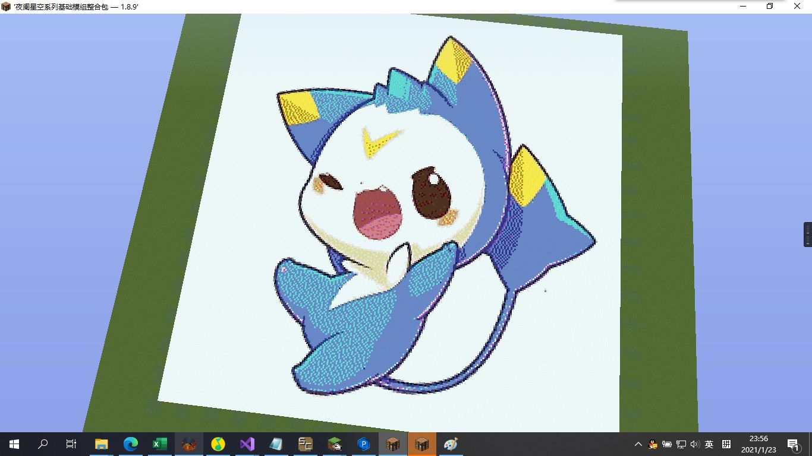

# 主城像素画

主城 天上那玩意 用像素画生成器+MCEDIT弄进去的

> 下载后解压去.minecraft文件夹下面的saves文件夹就好

<a href="/map/迪莫 150x.zip" target="_blank">地图下载（150x)</a>

<a href="/map/迪莫 256x.zip" target="_blank">地图下载（256x)</a>

## 原图

不知道在哪找的

生成的地图

看任务栏就知道这么做的了吧，，，