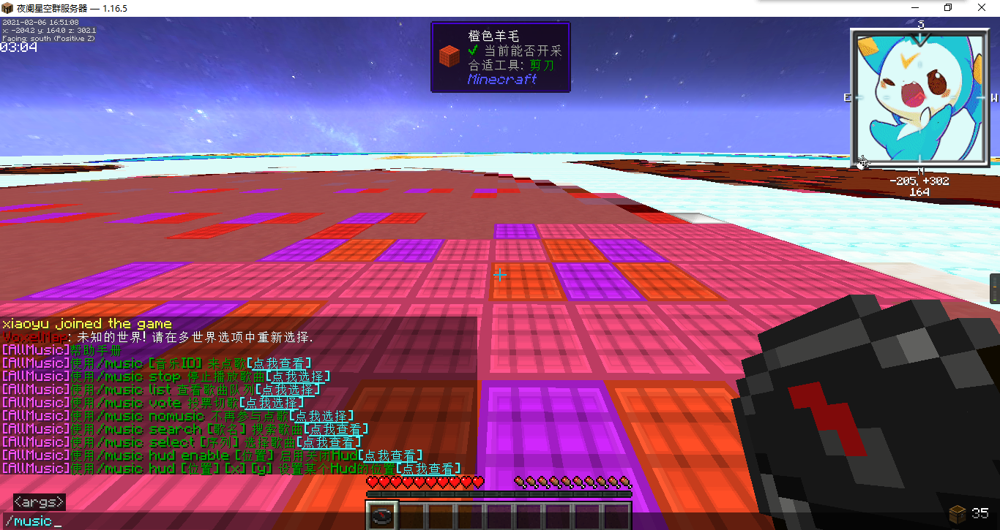
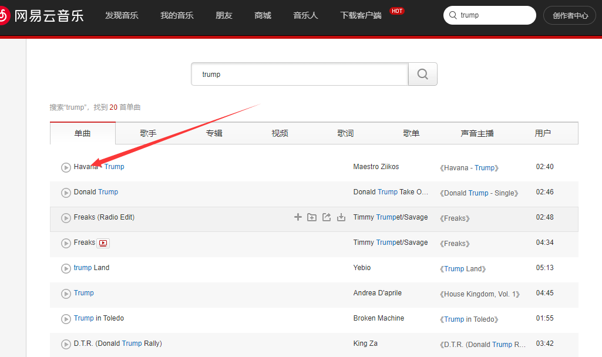
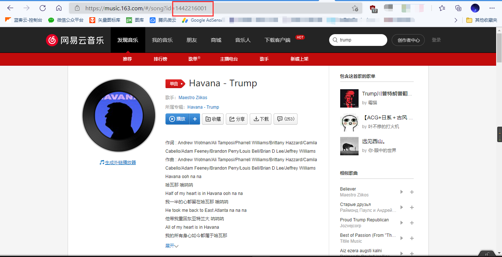

# 群服务器点歌系统

本服务器全服支持点歌！

### 使用方法

#### 1.点歌

```
/music search 音乐名字
```

然后，进入输入模式，点击想选的歌曲

或者使用网易云音乐id点歌（获取id下面会讲到）

```
/music 音乐id
```

#### 2.切歌

切歌需要投票

投票指令

```
/music vote
```

#### 3.不参与点歌

```
/music stop
```

#### 4.查看歌曲列表

```
/music list
```

#### 5.其它功能

自己输入help看。。

```
/music help
```



### 获取网易云音乐ID

#### 1.搜索歌曲

打开<a href="https://music.163.com/" target="_blank">网易云音乐网页版</a>

（https://music.163.com/）


在搜索栏找到歌曲，并点进去歌曲详细页面



#### 2.获取音乐ID

点击去后 你会发现，浏览器的URL地址就显示ID了

